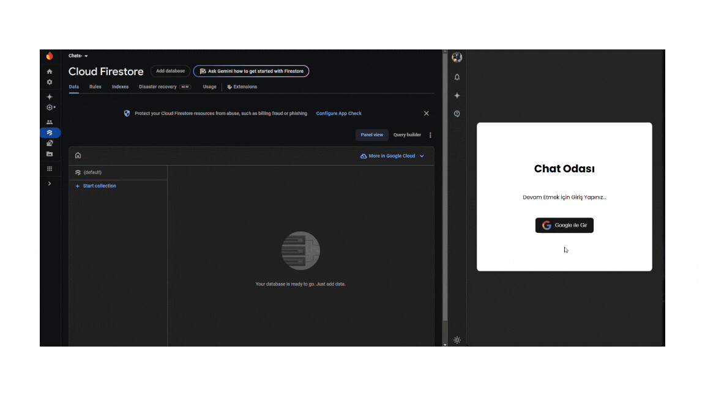

# Chat Application

This project is a real-time chat platform built using React and Firebase. It includes features like Google account login, chat room selection, and instant messaging.

## Features

- **Google Login:** Users can log in using their Google accounts.
- **Room Selection:** Choose a chat room after logging in.
- **Real-Time Messaging:** Send and receive messages instantly.
- **User-Specific Colors:** Each user in a group chat has a unique color tone for their name.
- **Emoji Support:** Add emojis to your messages using an emoji picker.

## Libraries Used

- **react:** Used to build and manage user interfaces.
- **react-dom:** Facilitated linking React components to the actual DOM in the browser.
- **emoji-picker:** Provided a user interface for adding emojis to messages.
- **dotenv:** Ensured secure storage of Firebase credentials and other sensitive data using environment variables.
- **sass:** Used for styling the application and creating dynamic, responsive designs.
- **firebase:** Powered authentication, real-time database functionality, and instant messaging.

---

## Live Demo

The project is live and accessible via [Vercel]
**Link:** [https://react-firebase-chat-app-iota.vercel.app/).](#)

